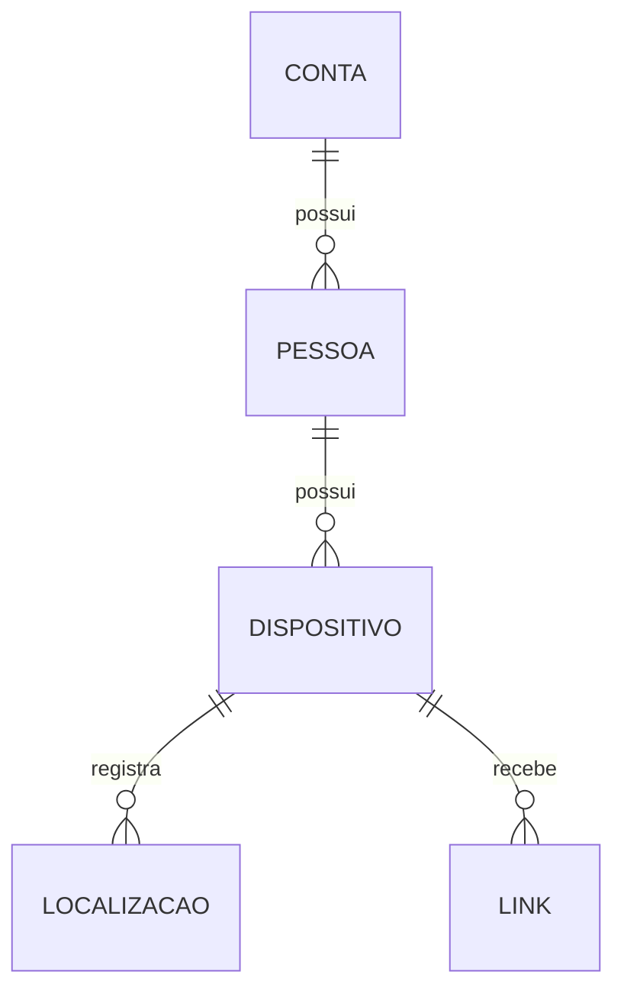
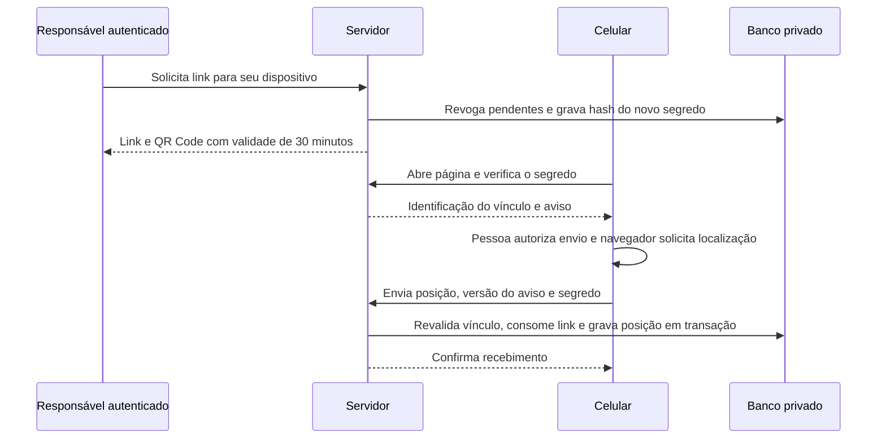

# Guia de estudo do sistema

Este mapa explica a implementação existente em 26/09/2026. Use o [relatório da sessão](REVISAO-2026-09-26.md) para consultar problemas reproduzidos, mudanças, testes e limitações de cada etapa. O [roteiro futuro](PROXIMAS-FASES.md) separa o frontend e o aplicativo instalável das funcionalidades já implementadas.

## 1. Entender os dados antes das telas

Leia [models.py](../rastreamento/models.py). Uma conta responsável possui pessoas; cada pessoa possui dispositivos; cada dispositivo possui posições e links de envio.

`Pessoa` começa com compartilhamento desativado. `Dispositivo` tem um estado próprio de ativação. `Localizacao` distingue o horário informado pelo cliente (`capturado_em`) do recebimento no servidor (`recebido_em`). Coordenadas têm limites no modelo e no banco. A precisão é opcional; quando recebida pelo fluxo normal, deve ser finita e não negativa.

O registro de autorização de uma posição guarda versão, texto e horário recebido pelo servidor. Isso documenta o envio, mas não prova identidade física ou veracidade das coordenadas. Estude [autorizacao.py](../rastreamento/autorizacao.py) e [tests/test_autorizacao.py](../tests/test_autorizacao.py).

## 2. Seguir uma operação do painel

As rotas começam em [config/urls.py](../config/urls.py). [painel.py](../rastreamento/painel.py) consulta somente pessoas da conta conectada e monta histórico paginado. [forms.py](../rastreamento/forms.py) valida os formulários. O navegador usa [painel.js](../rastreamento/static/rastreamento/painel.js) para o envio pontual e carregamento solicitado do mapa.

Não confunda a posição capturada no navegador do computador com a posição do celular cadastrado. Cadastrar um dispositivo cria um vínculo no sistema; não instala software nem concede permissão de localização ao aparelho.

Leia em seguida [test_painel.py](../tests/test_painel.py), observando os casos que tentam consultar cadastros alheios. Os identificadores UUID não substituem a conferência de propriedade.

## 3. Seguir o QR Code até o banco

Leia [celular.py](../rastreamento/celular.py) e [celular.js](../rastreamento/static/rastreamento/celular.js). O segredo está no fragmento do link e o JavaScript o remove do endereço visível; a requisição de envio usa o corpo. O banco guarda o hash do segredo. Um link usado, expirado ou revogado não permite outro envio. Uma falha de gravação deve desfazer seu consumo.

O receptor público usa [mobile_root_urls.py](../config/mobile_root_urls.py), que expõe somente as rotas do celular. [servidor-celular.py](../scripts/servidor-celular.py) inicia esse receptor separado do painel. O QR atual abre uma página web; ainda não instala aplicativo nem coleta em segundo plano.

Verifique esses comportamentos em [test_celular.py](../tests/test_celular.py) e [test_estado_envio.py](../tests/test_estado_envio.py). O aparelho ainda precisa permitir geolocalização e acessar o endereço HTTPS disponível.

## 4. Entender a API e a gravação

[views.py](../rastreamento/views.py) define as operações e filtra consultas pela conta autenticada. [serializers.py](../rastreamento/serializers.py) valida vínculos, coordenadas, precisão, horário e autorização. [parsers.py](../rastreamento/parsers.py) trata JSON excessivamente aninhado como requisição inválida.

[servicos.py](../rastreamento/servicos.py) recarrega conta, pessoa e dispositivo antes de gravar. Uma autorização verificada no começo da requisição pode ter mudado. A ordem comum de consulta/bloqueio e as transações reduzem esse risco; o SQLite ainda requer atenção à contenção de gravações e não foi submetido a ensaio de carga nesta sessão.

Para estudar limites, comece por [test_api.py](../tests/test_api.py): acesso sem autenticação, objetos alheios, coordenadas inválidas, datas e ordenação do histórico. Os testes usam dados fictícios e banco de teste.

## 5. Separar os controles de acesso

| Controle | Onde estudar | O que faz |
| --- | --- | --- |
| Autenticação e tentativas de login | [settings.py](../config/settings.py), [test_security.py](../tests/test_security.py) | Sessões/tokens e bloqueio de tentativas repetidas |
| Administração global | [config/admin.py](../config/admin.py), [config/apps.py](../config/apps.py) | Exige superusuário ativo e da equipe, inclusive para contas e tokens |
| Revogação de links | [models.py](../rastreamento/models.py) | Desativar compartilhamento/dispositivo impede reaproveitar links após reativação |
| Desativação da conta | [signals.py](../rastreamento/signals.py) | Revoga links pendentes, remove token da API e avança a versão das sessões |
| Sessões de navegador | [security.py](../rastreamento/security.py), [test_sessoes.py](../tests/test_sessoes.py) | Compara a versão e encerra sessões anteriores à desativação |
| Cabeçalhos e cache | [security.py](../rastreamento/security.py) | Restringe permissões do navegador e evita cache de respostas dinâmicas |

As regras acionadas por `save` não se aplicam automaticamente a SQL externo ou `QuerySet.update`. Superusuários têm acesso global. Tokens e sessões usam controles distintos; a desativação da conta aciona ambos nos fluxos normais. Esses limites fazem parte da revisão, não devem ser ocultados por uma contagem de testes aprovados.

## 6. Operar sem misturar código e dados

- [Armazenamento privado](ARMAZENAMENTO-PRIVADO.md): configuração opcional de destino, segredos e verificador antes do commit. Exclusão do Git não desativa OneDrive.
- [Backup e recuperação](BACKUP-RECUPERACAO.md): inspeção em leitura, ensaio isolado e risco de recuperar acessos antigos.
- [Retenção](RETENCAO.md): limpeza com simulação por padrão, escopo explícito e confirmação de quantidade. Não define prazo legal.
- [Privacidade e LGPD](PRIVACIDADE-LGPD.md): requisitos ainda pendentes antes de uso com terceiros.

Para acompanhar alterações no VS Code, compare um arquivo com o teste do mesmo fluxo e consulte o motivo no relatório. Não copie banco, chave, links temporários ou registros reais para exemplos públicos. As próximas decisões de interface e aplicativo devem preservar as regras de acesso e autorização descritas aqui.
